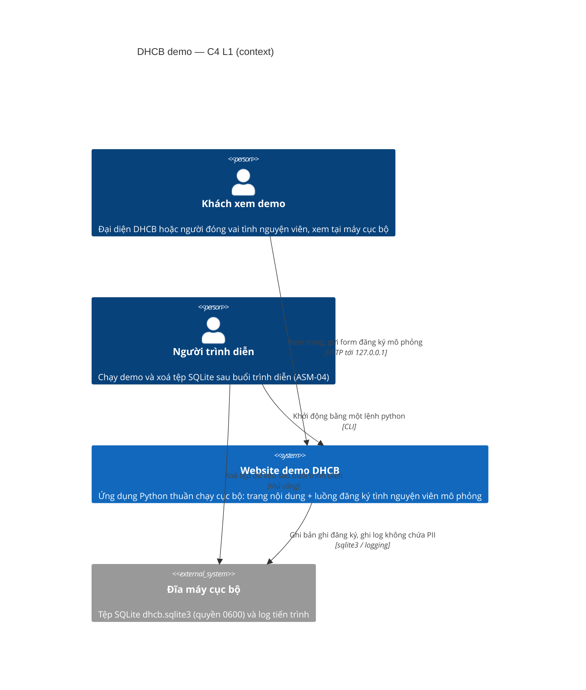
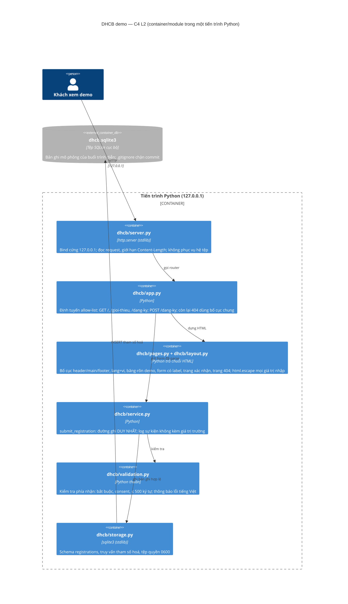

# Kiến trúc bản demo DHCB — C4 mức 1 và mức 2

- project_id: DHCB
- Phiên bản: 1.0 (đầu vào cho ticket DHCB-1..DHCB-6)
- Nguồn: `approved-specs` DHCB PRD 1.0 (M-01..M-12, NFR-01..NFR-05, CST-01..CST-04), threat model v1 (T-01..T-16), ADR-001..ADR-006.
- Giới hạn bằng chứng: lời gọi lập kế hoạch này không có tool nên không đọc trực tiếp repo khách; dữ kiện repo (Python thuần, `pyproject.toml`, gói `dhcb/`, `tests/`, pytest + ruff) là bằng chứng thứ cấp dẫn lại từ spec và mô tả môi trường thực thi.

## 1. Ngôn ngữ chung
Dùng đúng thuật ngữ trong `glossary` của dự án: đăng ký, bản ghi đăng ký, ô đồng ý, trang xác nhận, băng-rôn bản demo, SQLite cục bộ.

## 2. C4 mức 1 — Bối cảnh hệ thống



Ngoài phạm vi (W-04, W-11): không có kênh nhận bên thứ ba, không có email/SMS, không có tên miền công khai, không có phân tích lưu lượng.

## 3. C4 mức 2 — Container / module

Demo chạy trong ĐÚNG MỘT tiến trình. Theo skill `architecture`, mặc định là modular monolith; không có lý do tách dịch vụ (một người xem, chạy cục bộ, không có nhịp triển khai riêng).



## 4. Hướng phụ thuộc (ports & adapters ở quy mô nhỏ)

```
server  →  app  →  { pages, service }
                     service  →  { validation, storage }
```

- `validation.py` là hàm thuần: KHÔNG import `http.server`, `sqlite3`, `logging`.
- `pages.py`/`layout.py` KHÔNG import `sqlite3` và KHÔNG gọi `service`.
- `storage.py` KHÔNG import `http.server` và KHÔNG dựng HTML.
- Không có vòng phụ thuộc giữa module; phát hiện vòng là finding block.

## 5. Chủ sở hữu dữ liệu và ranh giới giao dịch
- Một bounded context duy nhất: "Đăng ký tình nguyện viên". Chủ sở hữu bảng `registrations` là `storage.py`; không module nào khác mở kết nối SQLite.
- Ranh giới giao dịch = một lượt gửi form. Hợp lệ ⇒ đúng một INSERT commit; không hợp lệ ⇒ không mở giao dịch nào (M-05, M-07).
- Không có nhất quán cuối, không có hàng đợi, không có tác vụ nền.

## 6. Ánh xạ NFR ⇄ cấu trúc
| NFR | Cấu trúc thoả mãn |
|---|---|
| NFR-01 tiếp cận | `layout.py` phát `lang="vi"` + `pages.py` phát `<label for>`/`aria-describedby`; test phân tích HTML bằng `html.parser` |
| NFR-02 bảo mật (escape) | Mọi giá trị nhập chỉ ra HTML qua một hàm bọc `html.escape` trong `pages.py` (ADR-005) |
| NFR-03 riêng tư (log) | Chỉ `service.py` được log; log là sự kiện + tên trường lỗi, không có giá trị trường (ADR-006) |
| NFR-04 test offline | Không phụ thuộc ngoài, không mạng, không trình duyệt: test gọi thẳng router và hàm dựng trang |
| NFR-05 một lệnh chạy | `python -m dhcb.server` dùng stdlib, không cài gói (CST-01) |

## 7. Đánh đổi đã chấp nhận
- Được: không toolchain thứ hai, test chạy offline, phạm vi nhỏ đúng mức demo. Mất: không template engine nên HTML nằm trong chuỗi Python, khó mở rộng nhiều trang nội dung.
- Ngưỡng quyết định này sai: khi bản đầy đủ cần > khoảng 6 trang nội dung hoặc cần biên tập nội dung bởi người không lập trình ⇒ xem lại ADR-001.
- `http.server` không phải máy chủ chịu tải; chỉ hợp lệ vì W-11/W-12 (chạy cục bộ, một người xem). Công khai ra ngoài localhost là vi phạm kiến trúc, không phải chỉnh cấu hình.

## 8. Xử lý khi hỏng
- Không có phụ thuộc mạng ⇒ không cần timeout/retry/circuit breaker.
- Lỗi ghi SQLite (đĩa đầy, tệp chỉ đọc): trả trang lỗi có bố cục chung, không lộ traceback (T-07), log sự kiện không kèm PII.
- Đường dẫn không có trong allow-list: 404 có băng-rôn và liên kết về trang chủ (M-03, M-01 đường lỗi).

## 9. Fitness function (chạy cùng ruff + pytest)
- FF-01: test khẳng định `dhcb/validation.py` và `dhcb/storage.py` không import `http.server`; `dhcb/pages.py` không import `sqlite3`.
- FF-02: test khẳng định `pyproject.toml` không khai báo phụ thuộc runtime bên thứ ba (CST-01, T-15).
- FF-03: test điều hướng — mọi liên kết nội bộ trích từ HTML thật đều có route trả 200 (ticket DHCB-6; đây là bài học từ lần trước, khi thiếu ticket tích hợp thì điều hướng trả 404).
- FF-04: test khẳng định log của một lượt đăng ký không chứa giá trị họ tên, số điện thoại, email.

## 10. ADR liên quan
ADR-001 (Python thuần), ADR-002 (SQLite cục bộ, một đường ghi), ADR-003 (không dữ liệu thật), ADR-004 (không nhật ký kiểm toán — chờ chữ ký), ADR-005 (escape + kiểm tra phía nhận), ADR-006 (không PII trong log). Đổi bất kỳ quyết định nào ⇒ cập nhật threat model và ước lượng chi phí.
