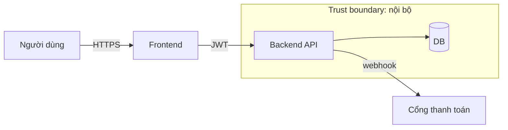

# Threat model: <dự án> — v<n>

- project_id: P-xx · spec: SPEC-xx · ASVS level: L2|L3
- Ngày · Tác giả: security-engineer · Người duyệt (Gate 2):

## 1. Data-flow diagram

## 2. Tài sản
| ID | Tài sản | Phân loại | Chủ |
|---|---|---|---|

## 3. Threat (STRIDE)
| ID | Category | Asset | Kịch bản | CVSS | Mitigation | Owner | Ticket | Trạng thái |
|---|---|---|---|---|---|---|---|---|
| T-01 | Spoofing | | | | | | | open |

## 4. Rủi ro chấp nhận (link ADR, người ký)
## 5. PII và DPIA (link)
## 6. Thay đổi so với version trước
